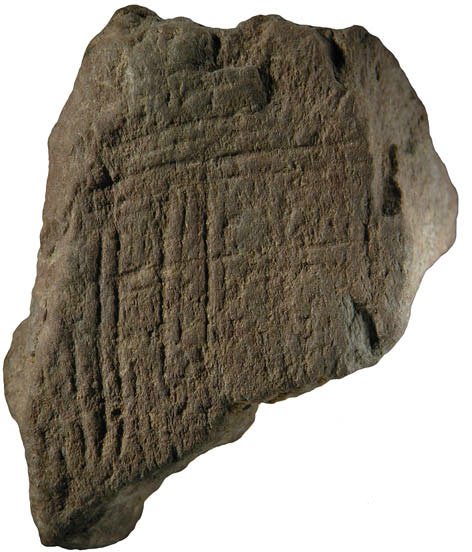
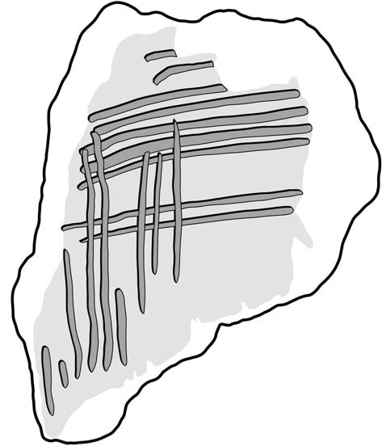
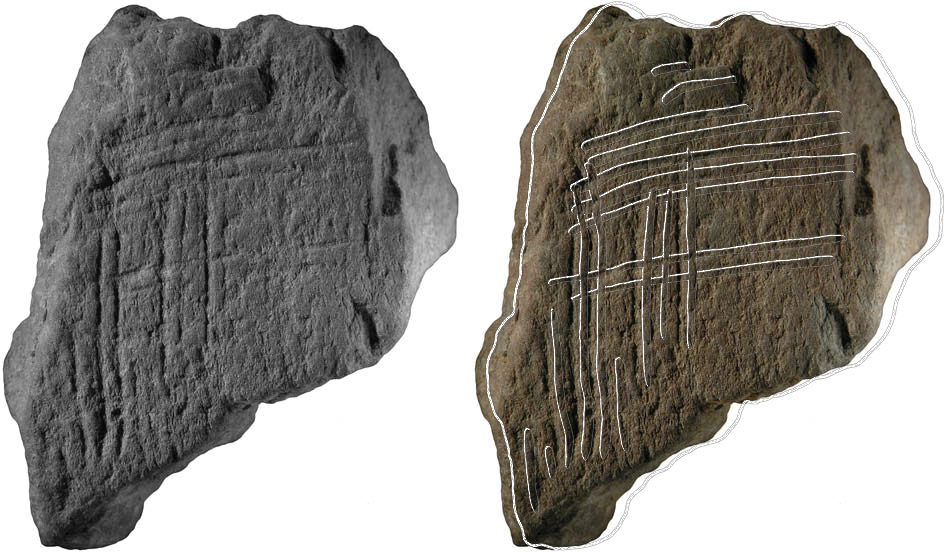

# SiteInspector - Teilaufgabe 1

Bei Ausgrabungen werden meist noch vor Ort Zeichnungen von den Fundstücken angefertigt. Oft sind bestimmte Charakteristiken darauf klarer zu erkennen als auf Fotos. Heute werden wir ein Tool entwickeln, das die Fotos den Zeichnungen gegenüberstellt und z.B. Illustrationen für wissenschaftliche Publikationen erstellen kann. Die Bildbeispiele zeigen altsteinzeitliche Ritzzeichnungen auf Ocker aus der Blombos-Höhle in Südafrika. Die Publikation, welche diese Aufgabe inspiriert hat, finden Sie [hier](https://www.sciencedirect.com/science/article/pii/S0047248409000207).

## ImageSeries: Verwaltung einer Bildreihe

Implementieren Sie eine Klasse ```ImageSeries```, die alle Bilddateien (Frames) aus einer Dateiliste einliest und verwaltet. Lesen Sie bitte zunächst die Aufgabe bis zum Ende: Es ist sehr empfehlenswert, die Implementation nicht stur in dieser Reihenfolge durchzuführen, sonder stückweise ```ImageSeries``` und ```Frame``` parallel zu implementieren, so dass man immer testen kann, ob die bisher implementierte Funktionalität auch korrekt ist.

```ImageSeries``` soll folgende Methoden enthalten:
* Einen Konstruktor ```ImageSeries(File[] files)```: Bekommt die einzulesenden Dateien. Merkt sich die Dateipfade, und liest alle Bilder aus ```files``` in eine interne Liste (am besten eine ```ArrayList``` - wir werden immer wieder über den Index auf die frames zugreifen) von ```Frame``` ein. Dabei besteht ein Datensatz für ein ```Frame``` aus mindestens je einem einzulesenden Foto und einer Zeichnung (s.u.). Per Konvention endet die dem Foto zugehörige Zeichnung auf dass Suffix *_tracing*. Heisst also das Foto z.B. *engraving-1.png*, so muss der Name der Zeichnung *engraving-1_tracing.png* lauten. Ist zu einem in ```files``` angegebenen Foto keine Zeichnung vorhanden, soll ein Fehler signalisiert werden. Optional können auch Grauwertbilder (mit dem Suffix *_grayscale*) und halbtransparente Überblendungen (mit dem Suffix *_overlay*) geladen werden. Da diese jedoch vom Programm erst erzeugt werden, sollen eventuelle Exceptions ignoriert und nur das entsprechende ```BufferedImage``` auf null gesetzt werden.

 

* ```public void writeFrames(int from, int to, boolean grayscale, boolean overlay, boolean combined)```: Speichert die Bilder aus den frames von ```from``` bis ```to``` in Bilddateien im *.png*-Format. Fall ```grayscale``` ```true``` ist, werden die entsättigten Fotos gespeichert (mit dem gleichen Namensschema wie oben beschrieben). Falls ```overlay``` ```true``` ist, werden die halbtransparente Überblendungen ausgegeben (wieder mit dem oben angegebenen Namensschema). Falls ```combined``` ```true``` ist, wird das Resultatbild mit dem Suffix *_combined* ausgegeben. Hier empfiehlt es sich sehr, zunächst sowohl in dieser Methode als auch in der ersten Implementation von ```Frame```, auf die Bildverarbeitung zu verzichten, und erst zu überprüfen, ob die eingelesenen frames korrekt als png gespeichert werden.

## Frame: Ein Einzelbild

Implementieren Sie zudem eine Klasse ```Frame```, die ein einzelnes frame verwaltet. Sie soll folgende Methoden enthalten:
* Einen Konstruktor ```public Frame(BufferedImage image, BufferedImage grayscaleImage, BufferedImage tracing, BufferedImage overlay)```: Merkt sich die übergebenen BufferedImages. Wenn ```grayscaleImage``` ```null``` ist, wird ```computeGrayscaleImage()``` aufgerufen. Ist ```overlay``` ```null```, wird ```computeOverlay()``` aufgerufen. In jedem Fall wird am Ende mittels ```computeCombinedImage()``` das Resultatbild berechnet.

* ```public BufferedImage getImage()```: Gibt das Originalfoto zurück
* ```public BufferedImage getTracing()```: Gibt die Originalzeichnung zurück
* ```public BufferedImage getGrayscaleImage()```: Gibt das entsättigte Originalfoto  (im Farbmodus BufferedImage.TYPE_BYTE_GRAY) zurück
* ```public BufferedImage getOverlay()```: Gibt die invertierte Originalzeichnung mit als RGB-Bild mit Alpha-Kanal zurück
* ```public BufferedImage getCombinedImage(boolean showTracing)```: Gibt das Resultatbild zurück. Ist ```showTracing``` true, soll das Originalfoto mit dem Overlay überblendet werden, andernfalls wird nur das Originalfoto dem Grauwertbild gegenübergestellt. Hat sich der Wert von ```showTracing``` seit dem letzten Aufruf verändert, so muss ```computeCombinedImage()``` erneut aufgerufen werden.

### Bildverarbeitung

* ```computeGrayscaleImage()``` soll ein Bild (im Farbmodus BufferedImage.TYPE_BYTE_GRAY) erzeugen, das das entsättigte Originalfoto enthält.
Es bietet sich dabei an, die folgende Hilfsmethode zu verwenden:
* ```private int brightness(BufferedImage image, int x, int y)```: Gibt das Pixel an den Koordinaten ```x``` und ```y``` im Bild ```image``` als Grauwert zurück. Der Grauwert soll dabei berechnet werden als das Maximum des Rot-, Grün- und Blau-Kanals. Dies entspricht der Helligkeitsdefinition des HSB (Hue-Saturation-Brightness) Farbmodells, die in unserem Fall die Struktur des Ockers am besten herausarbeitet.
* ```computeOverlay()``` soll zunächst das eingelesene Tracing invertieren, so dass ursprünglich helle Pixel dunkel und ursprünglich dunkle Pixel hell dargestellt werden. Das Ergebnis soll in einem Bild im Farbmodus ```BufferedImage.TYPE_INT_ARGB``` gespeichert werden, wobei der Alpha-Kanal so befüllt werden soll, dass ein Pixel um so transparenter ist, je niedriger der errechnete Grauwert ausfällt.
* ```computeCombinedImage()``` soll das Grauwertbild dem Originalfoto in einem ```BufferedImage``` gegenüberstellen. Dabei sollen die Bilder, wenn Sie im Hochformat vorliegen, nebeneinander, wenn Sie im Querformat vorliegen, untereinander angezeigt werden. Das Originalfoto soll auf Wunsch mit dem Overlay überblendet werden. Dass Foto und Overlay nicht exakt übereinander zu liegen kommen, soll uns zunächst nicht weiter stören. Das werden wir in einer der Folgeaufgaben beheben.



## SiteAnalysis

Nutzen Sie die Main-Klasse ```SiteAnalysis```, die die Beispieldateien als ```ImageSeries``` einliest, um von einem frame Ihrer Wahl sowohl das entsättigte Originalbild als auch das Overlay, sowie das Resultatbild inkl. Overlay auszugeben. Bitte committen Sie nicht die gesamte erzeugte Bilderreihe!

Da automatische Tests mit Bildern schwer umzusetzen sind, und ich Ihnen wieder lauter Testfehler ersparen möchte, ersetzen Sie bitte wieder einfach die drei Bilder ```Aufgabe1_grayscale.png```, ```Aufgabe1_overlay.png```, sowie ```Aufgabe1_combined.png``` im Verzeichnis ```Bilder``` durch die Ausgaben Ihres Programms. Sie sollten dann hier erscheinen:

Grayscale:


Overlay:


Combined:

